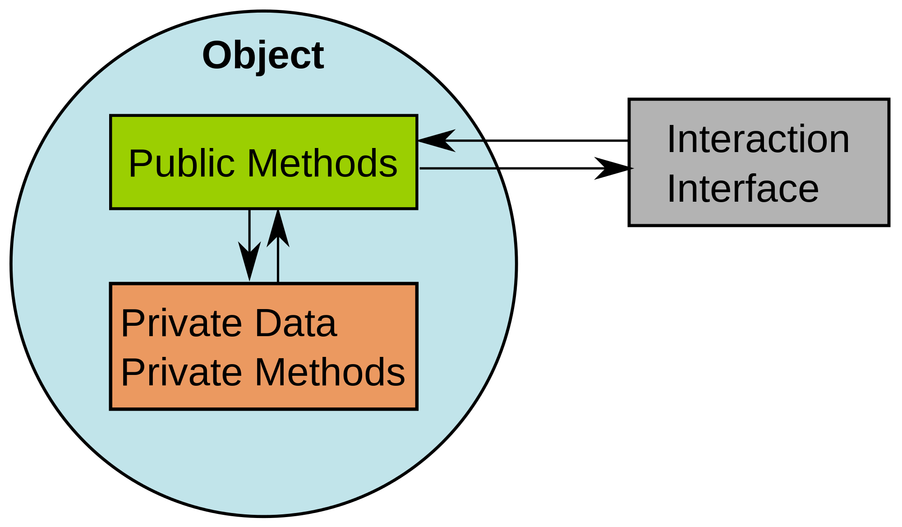
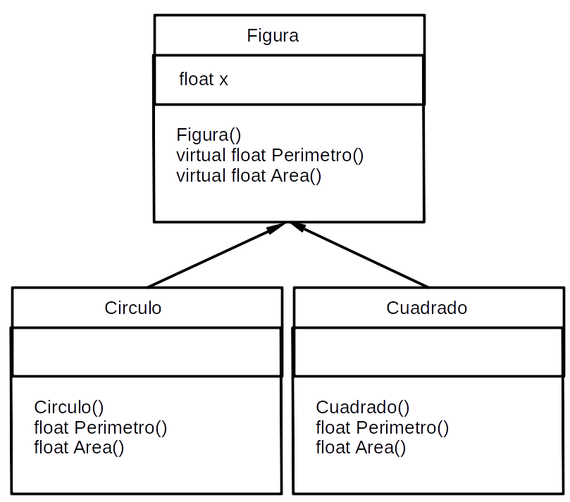
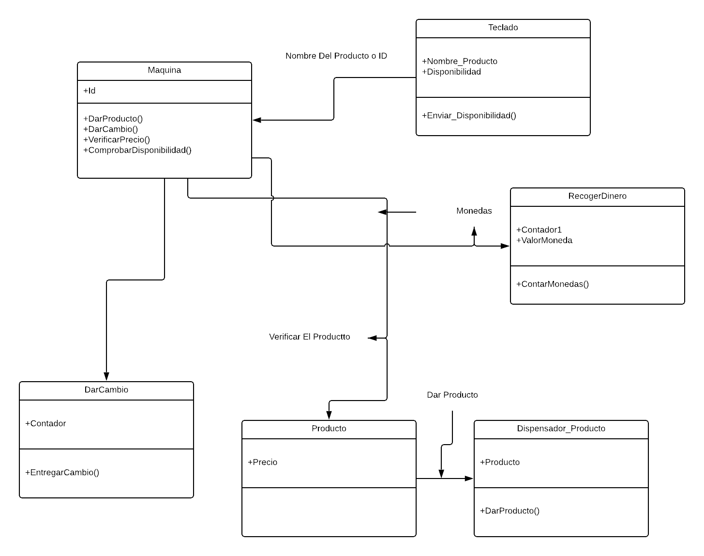

# Programación orientada a objetos

## **Tarea 1**

### **Programación Orientada A Objetos**

* #### Paradigma

Según mis conocimientos en la universidad, un paradigma en programación se refiere como a la forma de programar, en como se va realizar una tarea y de que forma se va plantear esta tarea. Examen.

Por ejemplo la forma de programar orientado a objetos es un ***estilo*** de programación, sin embargo existen diferentes, tal como lo es también la programación funcional.

* #### Abstracción

##### Por qué decimos que la Clase es el mecanismo de abstracción de los lenguajes OO

Decimos que la clase es un mecanismo de abstracción porque de esta clase obtenemos parámetros, que son como características que lo hacen único y que recolectan diferente información.

La ***abstracción*** , es una actividad cerebral que se emplea para comprender la complejidad del mundo y tener un panorama claro de la realidad. Para ello, se captan los atributos, funciones y características generales de un objeto.

**Ejemplo 1:**

***

1. ¿Qué características podemos abstraer de los automóviles? o ¿Qué características semejantes tienen todos los automóviles?

* Características: Marca, Modelo, Número de chasis, Peso llantas o cauchos, Puertas, Ventanas... Comportamiento: Acelerar, Frenar, Retroceder...

***

**Ejemplo 2:**

1. Extraer las características de un objeto como una motocicleta: Primero se definen que similitudes tienen todas las motocicletas y luego se toman factores como: marca, modelo, tamaño, rendimiento, entre otros.

***

#### Encapsulamiento

Consiste en unir en la Clase las características y comportamientos, esto es, las variables y métodos. Es tener todo esto en una sola entidad.

En los lenguajes estructurados esto era imposible. Es evidente que el encapsulamiento se logra gracias a la abstracción. La utilidad del encapsulamiento va por la facilidad para manejar la complejidad, ya que tendremos a las Clases como cajas rojas donde sólo se conoce el comportamiento pero no los detalles internos, y esto es conveniente porque nos interesará conocer que hace la Clase pero no será necesario saber cómo lo hace.
<!-- /* spell-checker: disable */ -->

<!-- /* spell-checker: enable */ -->

#### Herencia

Herencia para mí es como **mudar** los datos a algo mas, por ejemplo; si **carro** tiene ***color, marca y velocidad*** y supongamos que tenemos otro objeto que se llame **bicicleta** podemos heredar estos mismos parámetros, pues bicicleta también tendría esta información aunque sea diferente.

<!-- /* spell-checker: disable */ -->

<!-- /* spell-checker: enable */ -->

### **Diagrama De Clases**

* #### Historia examen

El Lenguaje Unificado de Modelado (UML) fue creado para forjar un lenguaje de modelado visual común y semántica y sintácticamente rico para la arquitectura, el diseño y la implementación de sistemas de software complejos, tanto en estructura como en comportamiento. UML tiene aplicaciones más allá del desarrollo de software, p. ej., en el flujo de procesos en la fabricación.

Es comparable a los planos usados en otros campos y consiste en diferentes tipos de diagramas. En general, los diagramas UML describen los límites, la estructura y el comportamiento del sistema y los objetos que contiene.

UML no es un lenguaje de programación, pero existen herramientas que se pueden usar para generar código en diversos lenguajes usando los diagramas UML. UML guarda una relación directa con el análisis y el diseño orientados a objetos.

***UML es una combinación de varias notaciones orientadas a objetos: diseño orientado a objetos, técnica de modelado de objetos e ingeniería de software orientada a objetos.***

| Booch        | Rumbaugh           | Jacobson  |
| ------------- |:-------------| :-----|
| Grady Booch (27 de febrero de 1955) es un diseñador de software, un metodologista de software y entusiasta del diseño de patrones. Es director científico de Rational Software (ahora parte de IBM) y editor de una serie de Benjamin/Cummings. En 1995 se recibió como miembro de la Asociación de Maquinaria Computacional (ACM). Fue nombrado socio de IBM en 2003.| James Rumbaugh (22 de agosto de 1947) es un científico de la computación y un metodologista de objeto. Es más conocido por su trabajo en la creación de la Técnica de Modelado de Objetos y el Lenguaje Unificado de Modelado (UML). Doctorado en ciencias de la computación por el M.I.T. Rumbaugh dirigió el desarrollo de la metodología OMT, en el Centro de Investigación y Desarrollo de la General Electric, donde trabajó durante más de 25 años. Se unió a Rational Software en 1994, y trabajó allí con Ivar Jacobson y Grady Booch ("los Tres Amigos") para desarrollar UML. Más tarde fusionaron sus metodologías de desarrollo de software, OMT, OOSE y Booch en el Proceso Unificado Racional (RUP). En el 2003 se trasladó a IBM, después de su adquisición de Rational Software. Se retiró en 2006. |Ivar Hjalmar Jacobson (2 de septiembre 1939, Ystad - ), es un ingeniero sueco en Ciencias de la computación. Inventó el diagrama de secuencia y desarrolló los diagramas de colaboración. También impuso el uso de diagramas de estado de transición para describir los flujos de mensajes entre los componentes. Fue uno de los desarrolladores originales del SDL (lenguaje de especificación), que se convirtió en estándar en 1967.

Estas son las cinco herramientas UML que probaría en primer lugar (sin ningún orden in particular).

**MagicDraw:** Me encanta su usabilidad. Pero aún me gusta más su motor de ejecución de modelos UML. NoMagic (la empresa detrás MagicDraw) ha sido comprada por Dassault Systems. Es de prever que, como consecuencia, MagicDraw siga mejorando en todo lo que se refiere a la ingeniería de sistemas donde este tipo de simulaciones a partir de modelos es clave.

**Papyrus UML**. El entorno de modelado estándar “de facto” en Eclipse. Gratuito y open source, Papyrus es sin duda la mejor opción si trabajas con Eclipse o necesitas integrar tus modelos con otros plug-ins de Eclipse como parte de tu proceso de desarrollo. Te acepto que Papyrus no es la herramienta más intuitiva ni fácil de usar pero se está esforzando para revertir la situación. Por ejemplo, recientemente ha sacado versiones especializadas para escenarios de uso concretos (e.g. Papyrus for Information Modeling o Papyrus for real-time).
Modelio. 

Herramienta muy potente, organizada en un núcleo open source al que se le pueden añadir funcionalidades mediante un sistema de extensión modular. Algunos de los modelos son también gratuitos pero muchos son ya extensiones comerciales,disponibles en la modelio store. Esta estructuración te permite adaptar la herramienta a tus necesidades de modelado UML. Por ejemplo, puedes empezar modelando gratis tu sistema y si luego decides utilizar esos modelos para generar código para la plataforma que sea, comprar la extensión correspondiente.

***

* #### Propuesta

